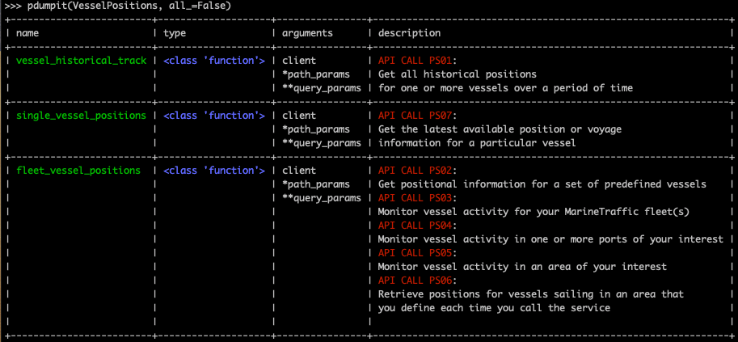

# Marine Traffic API Client Python Library

[](https://badge.fury.io/py/Marine-Traffic-API)
[](https://travis-ci.com/amphinicy/marine-traffic-client-api)


## Installation
Works with python 3.x.

```
pip install Marine-Traffic-API
```

## Initialize API

```python
from marinetrafficapi import MarineTrafficApi

api = MarineTrafficApi(api_key="__your_api_key_here__")
```

## Default params

```python
response = api.__api_call_method__(protocol='json'|'jsono'|'csv'|'xml', # default is jsono
                                   msg_type='simple'|'extended',  # default is simple
                                   timeout=10) # default is 5 (5 seconds)

# protocol and msg_type are call params 
# that could be used in any api call. 
# json protocol is not supported by models, for now.
# extended msg_type returns a lot more data but cost 
# a lot more api credits as well.

response.raw_data  # raw data from api call (json, csv or xml)
response.formatted_data  # data list
response.models  # list of Client models representing the data
```

## Vessels Positions

#### [PS01] Vessel History Track

```python
from marinetrafficapi import MarineTrafficApi

api = MarineTrafficApi(api_key="__your_api_key_here__")

vessel_positions = api.vessel_historical_track(period='daily', 
                                               days=3, 
                                               mmsi=241486000)

for position in vessel_positions.models:
	position.mmsi.value
	position.status.value
	position.speed.value
	position.longitude.value
	position.latitude.value
	position.course.value
	position.heading.value
	position.timestamp.value
	position.ship_id.value
	position.wind_angle.value
```

#### [PS02] Vessel Positions of a Static Fleet

```python
from marinetrafficapi import MarineTrafficApi

api = MarineTrafficApi(api_key="__your_api_key_here__")

vessels = api.fleet_vessel_positions(time_span=10)

for vessel in vessels.models:
	vessel.mmsi.value
	vessel.imo.value
	vessel.ship_id.value
	vessel.longitude.value
	vessel.latitude.value
	vessel.speed.value
	vessel.heading.value
	vessel.status.value
	vessel.course.value
	vessel.timestamp.value
	vessel.dsrc.value
	vessel.utc_seconds.value
	vessel.ship_name.value
	vessel.ship_type.value
	vessel.call_sign.value
	vessel.flag.value
	vessel.length.value
	vessel.width.value
	vessel.grt.value
	vessel.dwt.value
	vessel.draught.value
	vessel.year_built.value
	vessel.rot.value
	vessel.type_name.value
	vessel.ais_type_summary.value
	vessel.destination.value
	vessel.eta.value
	vessel.current_port.value
	vessel.last_port.value
	vessel.last_port_time.value
	vessel.current_port_id.value
	vessel.current_port_unlocode.value
	vessel.current_port_country.value
	vessel.last_port_id.value
	vessel.last_port_unlocode.value
	vessel.last_port_country.value
	vessel.next_port_id.value
	vessel.next_port_unlocode.value
	vessel.next_port_name.value
	vessel.next_port_country.value
	vessel.eta_calc.value
	vessel.eta_updated.value
	vessel.distance_to_go.value
	vessel.distance_travelled.value
	vessel.awg_speed.value
	vessel.max_speed.value
```

#### [PS03] Vessel Positions of a Dynamic Fleet
Same as PS02.

#### [PS04] Vessel Positions Within a port
Same as PS02.

#### [PS05] Vessel Positions in a Predefined Area
Same as PS02.

#### [PS06] Vessel Positions in a Predefined Area

```python
from marinetrafficapi import MarineTrafficApi

api = MarineTrafficApi(api_key="__your_api_key_here__")

vessels = api.fleet_vessel_positions(min_latitude=38.20882,
                                     max_latitude=40.24562,
                                     min_longitude=-6.7749,
                                     max_longitude=-4.13721,
                                     time_span=10)

for vessel in vessels.models:
	# same as PS02
```

#### [PS07] Single Vessel Positions

```python
from marinetrafficapi import MarineTrafficApi

api = MarineTrafficApi(api_key="__your_api_key_here__")

vessel = api.single_vessel_positions(time_span=20,
                                     mmsi=310627)

vessel = vessel.models[0]

vessel.mmsi.value
vessel.imo.value
vessel.longitude.value
vessel.latitude.value
vessel.speed.value
vessel.heading.value
vessel.status.value
vessel.course.value
vessel.timestamp.value
vessel.dsrc.value
vessel.ship_name.value
vessel.ship_type.value
vessel.call_sign.value
vessel.flag.value
vessel.length.value
vessel.width.value
vessel.grt.value
vessel.dwt.value
vessel.draught.value
vessel.year_built.value
vessel.type_name.value
vessel.ais_type_summary.value
vessel.destination.value
vessel.eta.value
vessel.eta_calc.value
vessel.current_port.value
vessel.current_port_id.value
vessel.current_port_unlocode.value
vessel.last_port.value
vessel.last_port_time.value
vessel.last_port_id.value
vessel.last_port_unlocode.value
vessel.next_port_id.value
vessel.next_port_unlocode.value
vessel.next_port_name.value
vessel.next_port_country.value
```

## Events

#### [EV01] Port Calls

```python
from marinetrafficapi import MarineTrafficApi

api = MarineTrafficApi(api_key="__your_api_key_here__")

events = api.port_calls(port_id=1,
                        gt_min=4000,
                        dwt_min=9000,
                        timespan=60)

for event in events.models:
    event.mmsi.value
    event.ship_name.value
    event.ship_id.value
    event.local_timestamp.value
    event.utc_timestamp.value
    event.move_type.value
    event.type_name.value
    event.unlocode.value
    event.draught.value
    event.load_status.value
    event.port_operation.value
    event.in_transit.value
    event.voyage_avg_speed.value
    event.voyage_max_speed.value
    event.voyage_idle_time.value
    event.elapsed_noanch.value
```

#### [EV02] Vessel Events

```python
from marinetrafficapi import MarineTrafficApi

api = MarineTrafficApi(api_key="__your_api_key_here__")

events = api.vessel_events(mmsi=355906000,
                           event_type=19,
                           timespan=160)

for event in events.models:
    event.mmsi.value
    event.ship_name.value
    event.timestamp.value
    event.event_id.value
    event.event_name.value
    event.event_content.value
```

#### [EV03] Berth Calls

```python
from marinetrafficapi import MarineTrafficApi

api = MarineTrafficApi(api_key="__your_api_key_here__")

berth_calls = api.berth_calls(dwt_min=2000,
                              dwt_max=70000,
                              timespan=20)

for berth_call in berth_calls.models:
    berth_call.ship_id.value
    berth_call.mmsi.value
    berth_call.imo.value
    berth_call.dock_local_time.value
    berth_call.dock_utc_time.value
    berth_call.dock_offset_time.value
    berth_call.undock_local_time.value
    berth_call.undock_utc_time.value
    berth_call.undock_offset_time.value
    berth_call.ship_name.value
    berth_call.type_name.value
    berth_call.grt.value
    berth_call.dwt.value
    berth_call.flag.value
    berth_call.year_built.value
    berth_call.berth_id.value
    berth_call.berth_name.value
    berth_call.terminal_id.value
    berth_call.terminal_name.value
    berth_call.port_name.value
    berth_call.port_id.value
    berth_call.unlocode.value
    berth_call.country_code.value
    berth_call.destination_id.value
    berth_call.destination.value
    berth_call.arrival_local_time.value
    berth_call.arrival_utc_time.value
    berth_call.arrival_draught.value
    berth_call.arrival_load_status.value
    berth_call.distance_travelled.value
    berth_call.voyage_average_speed.value
    berth_call.voyage_max_speed.value
    berth_call.voyage_idle_time.value
    berth_call.origin_name.value
    berth_call.origin_port_id.value
    berth_call.origin_departure_time.value
    berth_call.total_voyage_time.value
    berth_call.departure_local_time.value
    berth_call.departure_utc_time.value
    berth_call.departure_draught.value
    berth_call.departure_load_status.value
    berth_call.port_operation.value
    berth_call.time_at_berth.value
    berth_call.time_at_port.value
```

## Vessels Data

#### [VD01] Vessel Photos

```python
from marinetrafficapi import MarineTrafficApi

api = MarineTrafficApi(api_key="__your_api_key_here__")

vessel_photos = api.vessel_photos(vessel_id=310627000)

for vessel_photo in vessel_photos.models:
	vessel_photo.url.value
```

## Voyage Info

#### [VI03] Port Distance and Routes

```python
from marinetrafficapi import MarineTrafficApi

api = MarineTrafficApi(api_key="__your_api_key_here__")

routes = api.port_distances_and_routes(port_start_id=1, 
                                       port_target_id=10, 
                                       include_alternatives=True, 
                                       include_in_land=True)

for route in routes.models:
	route.distance.value
	route.panama.value
	route.suez.value
	route.final_path.value
```

## Exception Handling

```python
from marinetrafficapi import MarineTrafficApi
from marinetrafficapi import (MarineTrafficRequestApiException,
                              MarineTrafficClientApiException,
                              MarineTrafficFormatterException,
                              MarineTrafficException)

api = MarineTrafficApi(api_key="__your_api_key_here__")

try:
    routes = api.vessel_historical_track(...)
    
except MarineTrafficRequestApiException:
    """Handle Request Exceptions"""
    
except MarineTrafficClientApiException:
    """Handle Client Exceptions"""
    
except MarineTrafficFormatterException:
    """Handle Formatter Exceptions"""
    
except MarineTrafficException:
    """Handle All Marine Traffic Exceptions"""
    
```

## List all API call methods

There are quite a few api call methods and it's quite usefull to have a complete list in one place.

There is one very useful python package called `dumpit` with which you can easily list all methods and descriptions:

[https://github.com/arrrlo/dumpit](https://github.com/arrrlo/dumpit)

To list api call methods, do the following:

```python
from dumpit import pdumpit

from marinetrafficapi import Events
from marinetrafficapi import VoyageInfo
from marinetrafficapi import VesselPositions

pdumpit(Events, all_=False)
pdumpit(VoyageInfo, all_=False)
pdumpit(VesselPositions, all_=False)
```



## Response Models Descriptions

There are a lot of model fields and every one of them has it's own description which describes the data comming from the API.

````python
from dumpit import pdumpit
from marinetrafficapi import MarineTrafficApi

api = MarineTrafficApi(api_key="__your_api_key_here__")

request = api.vessel_historical_track(period='daily', days=3, mmsi=241486000)

pdumpit(request.models[0], all_=False)
````


## API call parameter list and descriptions

Every API call has it's own parameters.

To list them and to read description for every one of them, use following code:

````python
from marinetrafficapi import MarineTrafficApi

MarineTrafficApi.print_params_for('vessel_historical_track')
````


## Debugging

If you want to debug your code using the data regarding the API call.

```python
from marinetrafficapi import MarineTrafficApi

# initialize with debug=True
api = MarineTrafficApi(api_key="__your_api_key_here__", debug=True)

# after every API call the client library will automatically print all the data to standard output
api.vessel_historical_track(period='daily', days=3, mmsi=241486000)

# and you can always have all debug data in your code
debug_data = api.request.debug.show()
```

   

## Official documentation

For more information visit official documentation: [https://www.marinetraffic.com/en/ais-api-services/](https://www.marinetraffic.com/en/ais-api-services/)

# Changelog

## 0.10.0

#### Added:
- VD01 - Vessel Data 

## 0.9.0

#### Added:
- description fetching for API calls, query parameters, model properties, etc.

#### Fixed:
- models are now Model instances, not native type instances.
- better constants management
- better string formatting
- url preparation fixed

## 0.8.0

#### Added:
- EV03 - Berth Calls 

#### Fixed:
- default values for number field, real number field and datetime field

## 0.7.1

#### Fixed:
- better structure for exceptions 

## 0.7.0

#### Added:
- EV02 - Vessel Events 

## 0.6.1

#### Added:
- README badges fixed

## 0.6.0

#### Added:
- EV01 - Port Calls 